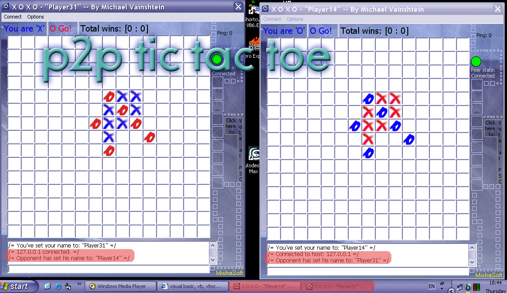

<div align="center">

## P2P Custom Sized Tic Tac Toe


</div>

### Description

A 14X14 Tic Tac Toe game over the internet [p2p]. The server side and client side are the same appliaction. You can customize the size of the board (14x14 max). User friendly and bug proof.
 
### More Info
 


<span>             |<span>
---                |---
**Submitted On**   |2005-11-05 18:42:36
**By**             |[Michael Vainshtein](https://github.com/Planet-Source-Code/PSCIndex/blob/master/ByAuthor/michael-vainshtein.md)
**Level**          |Beginner
**User Rating**    |4.7 (14 globes from 3 users)
**Compatibility**  |VB 5\.0, VB 6\.0
**Category**       |[Games](https://github.com/Planet-Source-Code/PSCIndex/blob/master/ByCategory/games__1-38.md)
**World**          |[Visual Basic](https://github.com/Planet-Source-Code/PSCIndex/blob/master/ByWorld/visual-basic.md)
**Archive File**   |[P2P\_Custom19474411102005\.zip](https://github.com/Planet-Source-Code/michael-vainshtein-p2p-custom-sized-tic-tac-toe__1-63224/archive/master.zip)

### API Declarations

```
' Uses the Winsock OCX
```


